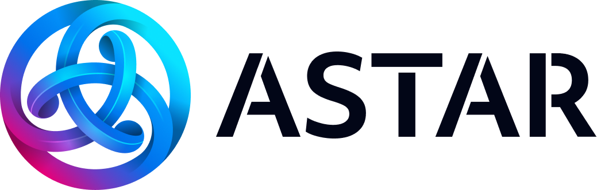

# 🚀 Astar Buildathon @ Cripto Latin Fest 2025 🎉

  
  

👉 Enlace de registro: [Regístrate aquí](https://forms.gle/v1jUtMVprAVP8NFo6)  
👉 Enlace de envío final: [Enviar aquí](https://forms.gle/BYmJ6hWfDFdAZXMu5)

---

## 📖 Acerca de
El **Astar Buildathon @ Cripto Latin Fest 2025** es una competencia de programación en línea de 2 días donde desarrolladores construyen proyectos de blockchain usando el Astar Ecosystem.  
💰 Bolsa de premios de **1000 USDT** dividida entre los **3 mejores proyectos**.

---

## 🗓️ Cuándo
- **Inicio:** Jueves, **21 de agosto, 2:00 PM**  
- **Cierre:** Viernes, **22 de agosto, 10:00 AM**

🕒 Todos los horarios están en GMT-5 (Hora Bogotá).

### 📚 Talleres y agenda

Los Workshops se realizan en la **Buildathon Zone** del venue principal
- **Workshop 1: “Building dApps on Astar”** — Jueves, 12:30 PM → 3:00 PM  
  Aprende a construir dApps en la Astar network. Despliegue básico de contratos e integración con UI.

- **Break & Networking**  
- **Workshop 2: “On-chain governance tools”** — Jueves, 3:30 PM → 4:30 PM  
  Profundiza en la creación de herramientas para la on-chain governance de Astar.
  
- **Submission Deadline:** Viernes, 10:00 AM  
- **Winners Announcement:** Viernes, 2:00 PM

🕒 Todos los horarios están en GMT-5 (Bogotá time).

---

## 💡 El desafío
Crea un **proyecto impactante** y completo con código funcionando y una presentación de negocio:

### 🎯 Tracks & Focus Areas
- ASTR Token Integration (obligatorio): Las aplicaciones deben usar el ASTR token como componente central.
- Governance Tools (recomendado): Integraciones que mejoren la participación en la on-chain governance de Astar.
- Entertainment & Consumer: Apps que impulsen casos de uso de entretenimiento y consumo utilizando el ASTR token.

### 🔧 Requisitos y Entregables

- ✅ Una **aplicación funcional** con la que las personas puedan interactuar  
- **Qué enviar:**  
  - Repository de GitHub que contenga:
    - código de la app
    - código de smart contract (si aplica)
    - documentación clara que incluya:
      - cómo ejecutar la app en desarrollo
      - enlace a la aplicación web en vivo
      - dirección del contrato en testnet

### 🎤 Pitch Deck
- ✅ Presentación clara que explique tu idea de negocio  
- **Qué enviar:**  
  - Carpeta pública en Google Drive que contenga:
    - PDF de las diapositivas
    - video de 3 minutos presentando tu concepto de negocio  
    - demo video de 3 minutos mostrando cómo funciona tu app  

## ✅ Reglas
- Tamaño del equipo: hasta 5 personas.
- Participantes individuales (solo) están permitidos.
- Solo se permite código nuevo escrito durante el hackathon. Puedes usar ideas previas o proyectos en progreso, pero tu Submission debe basarse en código nuevo producido en el evento.
- Submissions fuera de tiempo (después del límite) serán rechazadas.
- Submissions modificadas después del límite serán rechazadas.
- Plagio o Submissions fraudulentas resultarán en descalificación.
- Se permiten herramientas de IA y "vibe coding".

---

## 🏆 Criterios de evaluación
- **Technical feasibility**: Qué tan realista, acotada y alcanzable es la solución dado el skill del equipo.
- **Implementation quality**: Calidad de código, buenas prácticas de repository, architecture y efectividad de UI/UX.
- **Functionality**: Funcionalidad, fluidez de user flows y mínimos errores.
- **Ecosystem fit**: Utilidad dentro del Astar Ecosystem (especialmente para governance tools) o ajuste con usuarios objetivo en apps de consumo.
- **Creativity**: Originalidad y enfoque fresco; se valora un nuevo ángulo sobre un problema existente.
- **ASTR token implementation**: Profundidad, corrección y utilidad del uso del ASTR token.
- **Startale Cloud Services usage**: Adopción efectiva de Startale Cloud Services (cuando aplique).
- **Track alignment**: Qué tan bien se alinea el proyecto con los Tracks & Focus Areas establecidos.

---

## 🔗 Enlaces y documentación útiles
- [Astar Docs: Build Introduction](https://docs.astar.network/docs/build/Introduction/)  
- [Astar Docs: Integrations](https://docs.astar.network/docs/build/integrations/)  
- [Astar Docs: Get Test Tokens (Faucet)](https://docs.astar.network/docs/build/environment/faucet/)  
- [Astar Ecosystem](https://astar.network/ecosystem)  
- [Startale Cloud Services](https://startale.com/scs)  
- [Astar Network YouTube](https://www.youtube.com/@AstarNetwork/videos)  

